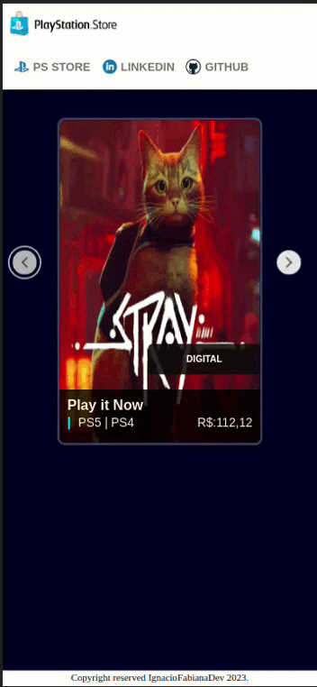

# Angular PS Store Gallery

<div align="center">
  


</div>

## :memo: Descrição

O Angular PS Store Gallery é um projeto que simula uma galeria de jogos da PS Store. Ele foi desenvolvido com o framework Angular e oferece uma interface para explorar e visualizar informações sobre jogos da PlayStation Store.

<div align="center">
  


</div>

## Estrutura de Diretórios

- A pasta components contém os principais componentes do projeto, incluindo card, menu-bar e footer.
- O componente card possui subcomponentes card-label e card-pricing.
- A pasta pages contém o componente home, responsável por renderizar o carrossel com os cards da galeria de jogos.
- A pasta data contém o arquivo dataFake.ts, que serve como um banco de dados local com as informações necessárias para alimentar dinamicamente os cards usando *ngFor.

<details>

<sumary>O projeto está organizado da seguinte maneira:</sumary>

```

angular-ps-store-gallery/
│
├── app/
│ ├── components/
│ │ ├── card/
│ │ │ ├── card-label/
│ │ │ └── card-pricing/
│ │ ├── menu-bar/
│ │ └── footer/
│ ├── pages/
│ │ └── home.component.ts
│ └── dat/
│ └── dataFake.ts
│
├── ...
│
└── README.md

```

</details>

## Componentes Principais
### Componente Card

O componente `card` exibe informações sobre um jogo da galeria e contém os seguintes elementos:

- Uma imagem do jogo.
- Informações sobre o jogo, como título, descrição e preço.
- Um link que redireciona para a página do jogo na PS Store.

### Componente Menu-Bar

O componente `menu-bar` apresenta um menu de navegação com três opções:

1. Um link que redireciona para a página da PS Store.
2. Um link para o LinkedIn do autor do projeto.
3. Um link para o GitHub do autor do projeto.

## Componente Home

O componente `home` é responsável por exibir o carrossel que apresenta a galeria de jogos. Ele usa os dados do banco de dados local `dataFake.ts` para alimentar dinamicamente os cards.

## Uso

Para executar o projeto em sua máquina local, siga estas etapas:

1. Clone o repositório:

   ```bash
   git clone https://github.com/seu-usuario/angular-ps-store-gallery.git

   ```

2. Navegue até o diretório do projeto:

   ```bash
   cd angular-ps-store-gallery

   ```

3. Instale as dependências:

   ```bash
   npm install

   ```

4. Inicie o servidor de desenvolvimento:

   ```bash
   ng serve

   ```

5. Abra um navegador da web e acesse `http://localhost:4200` para visualizar a galeria de jogos da PS Store.
